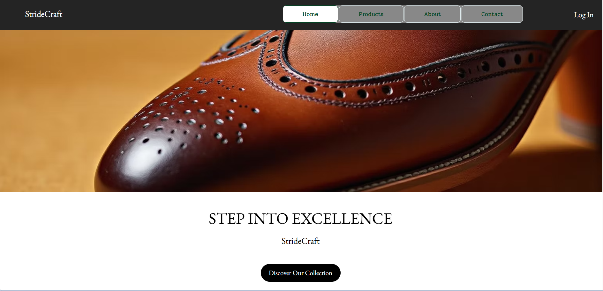
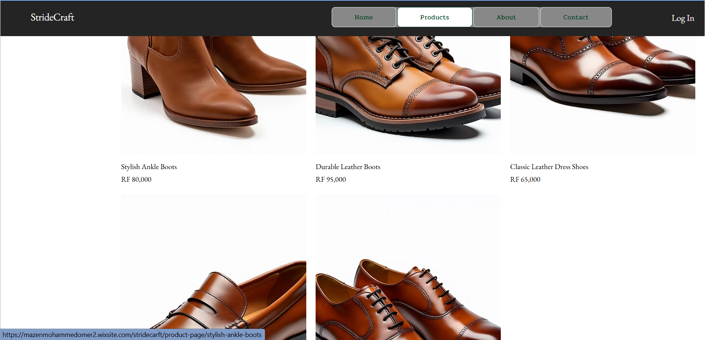
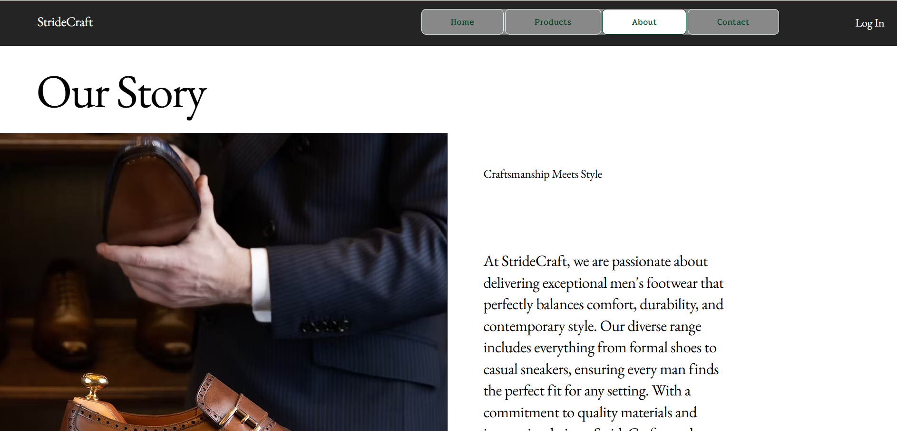
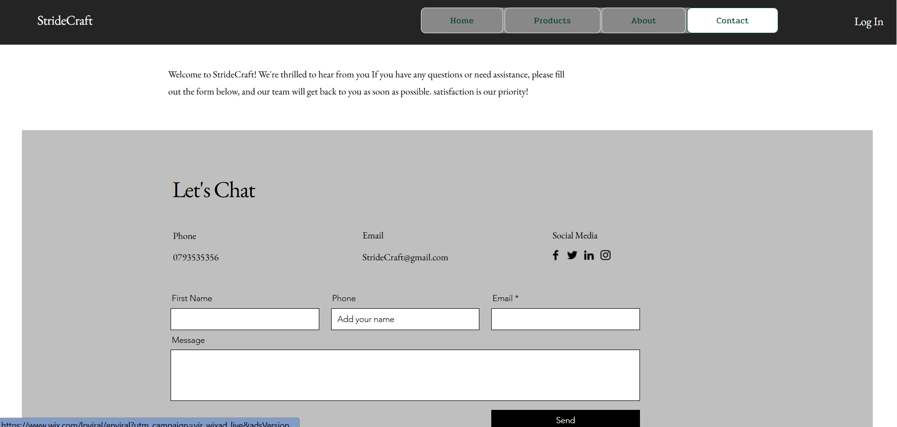
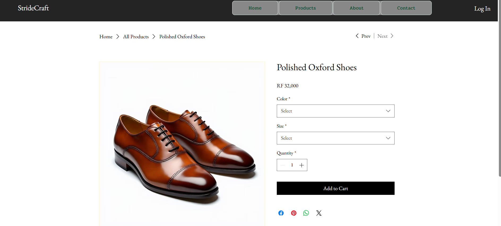

# Classic Men's Shoes Website

## Student Information

* Name: Mazen Mohammed
* Student ID: 23569/2023
* Course: E-Commerce and Web Application
* University: Unilak

---

## Project Title

**Classic Men's Shoes E-Commerce Website**

---

## Platform Used

This website was developed using **Wix Website Builder**. Wix was used to design and publish an online store that showcases classic men's shoes and provides customers with product information and purchasing options.

---

## Features Implemented

The website includes the following features:

* Home page with promotional banner
* Product catalog displaying men's shoes
* Product descriptions and pricing
* Navigation menu
* Contact information page
* Responsive design for mobile and desktop devices
* Shopping cart functionality
* Online ordering capability

---

## Screenshots

### Home Page

### Product Page

### About Page

### Contact Page

### Shopping Cart

---

## Challenges Faced

During the development of the website, several challenges were encountered:

1. Selecting a suitable website layout.
2. Organizing product information effectively.
3. Designing a responsive user interface.
4. Creating attractive product descriptions.
5. Understanding Wix customization options.

---

## Lessons Learned

Through this project, I learned:

* How e-commerce websites are structured.
* Website design principles and user experience concepts.
* How to use Wix for website development.
* Product presentation techniques.
* Basic online store management practices.
* GitHub repository management and documentation.

---

## Live Website Link

Website URL:

[https://your-wix-website-link.com](https://mazenmohammedomer2.wixsite.com/stridecarft)

---

## GitHub Repository Link

Repository URL:

[https://github.com/mazinomer/E-commerce_Men_Shoes_Store](https://github.com/mazinmohd/E-commerce_Men_Shoes_Store)
